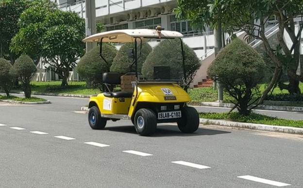
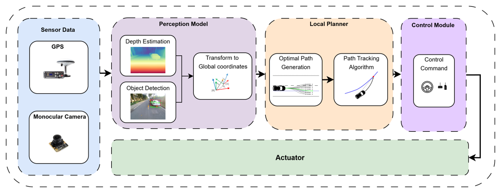
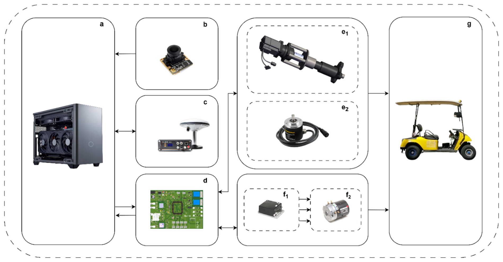
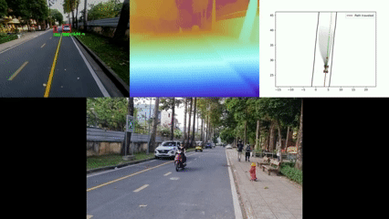
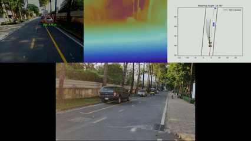
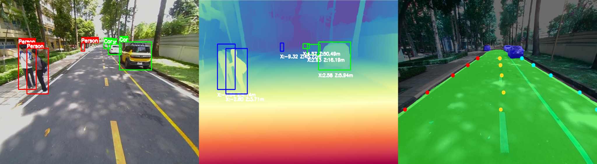

# RTK-GPS-BASED-AUTONOMOUS-DRIVING

A research project on **outdoor autonomous vehicle navigation** using **RTK-GPS**, **AI-based perception** (YOLOv11 + DepthAnything-V2), and **Frenet Optimal Trajectory Planning** with **Pure Pursuit Control**.  

## 📌 Overview  

This project implements an **autonomous golf-cart platform** tested at HCMUTE campus. The navigation stack combines centimeter-level localization, deep-learning-based perception, local planning, and low-level control.  

<p align="center">
  
</p>  

---

## 🚗 System Architecture  

<p align="center">
  
</p>  

**Pipeline**  
1. **Sensor Data**: RTK-GPS + Monocular Camera.  
2. **Perception**: YOLOv11 (object detection) + DepthAnything-V2 (depth estimation).  
3. **Planner**: Frenet Optimal Trajectory (local path generation).  
4. **Control**: Pure Pursuit (trajectory tracking).  
5. **Visualization**: PyQt5 GUI (map, obstacles, vehicle state).  

---

## 🔧 Hardware Setup  

<p align="center">
  
</p>  

- **Onboard PC**: Ubuntu, CUDA, PyTorch.  
- **Camera**: IMX335 USB.  
- **RTK-GPS**: Sino GNSS M900.  
- **Controller Board**: STM32 for steering/brake actuation.  
- **Actuators**: Steering servo (gearbox), brake motor.  
- **Platform**: ISLAB-C102 Golf Cart.  

---

## 🎯 Features  

- **Localization**: RTK-GPS with ±10 cm accuracy.  
- **Perception**: YOLOv11 (objects), DepthAnything-V2 (monocular depth), SegFormer-B0 (road segmentation).  
- **Planning**: Frenet Optimal Trajectory, smooth and collision-free.  
- **Control**: Pure Pursuit for stable path following.  
- **GUI**: PyQt5 interface with GPS map + live camera + planner view.  

---

## 📊 Demo  

**Full-stack demo (perception → depth → planning → control):**  

<p align="center">
  
  
</p>  

**Perception Snapshots:**  

<p align="center">
  
</p>  

---

## ⚙️ Installation  

### Requirements  
- Ubuntu 22.04 / 24.04  
- Python 3.9+  
- PyTorch 2.x (CUDA)  
- OpenCV, NumPy, Matplotlib, PyQt5  

### Setup  
```bash
git clone https://github.com/hoanganhidi0822/RTK-GPS-BASED-AUTONOMOUS-DRIVING.git
cd RTK-GPS-BASED-AUTONOMOUS-DRIVING
python -m venv .venv && source .venv/bin/activate
pip install -r requirements.txt
```

### Model Weights  
Download and place in `weights/`:  
- YOLOv11 → `yolo11n.pt`  
- DepthAnything-V2 → `depthanything_v2_vit_base.pth`  

---

## 🚀 Usage  

```bash
# Launch GUI (map + perception + planner)
./run.sh

```

---

## 📂 Repository Structure  

```
RTK-GPS-BASED-AUTONOMOUS-DRIVING/
├── gui/              # PyQt5 GUI
├── perception/       # YOLOv11 + DepthAnything-V2
├── planning/         # Frenet Optimal Trajectory
├── control/          # Pure Pursuit + PID
├── localization/     # GPS RTK
├── config/           # Calibration + params
├── scripts/          # Tools & data logging
├── weights/          # Pretrained models
└── main.py           # Entry point
```

---

## 📈 Results  

- **Localization**: ±10 cm (RTK fix).  
- **Obstacle depth error**: <0.2 m (longitudinal), <0.3 m (lateral).  
- **Trajectory tracking**: ~0.20 m average.  
- **Throughput**: ~20 FPS (RTX 3050 Ti).  

---

## 🛠 Roadmap  

- Sensor fusion (RTK-GPS + IMU).  
- HD-map + global path planning (A*).  
- LiDAR integration + multi-object tracking.  

---

## 👤 Author  

**Phan Văn Hoàng Anh**  
Final-year student @ HCMUTE  
Focus: AI Perception · Sensor Fusion · Autonomous Driving  
